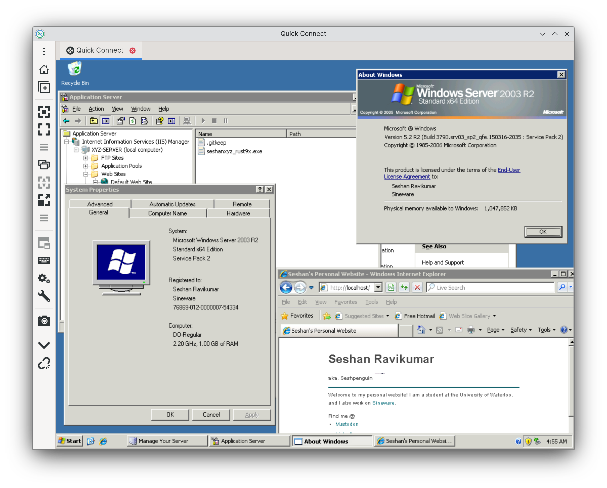

# Seshan.XYZ v4
This is the fourth iteration of my personal website, [seshan.xyz](https://seshan.xyz/).

The first 3 versions were:
- A static site with a ASP VBScript based blog system on Windows Server 2003 R2, IIS 6 (hosted on EC2).
- A WordPress site hosted on a PowerMac G5 running Ubuntu Server 16.04
- A Hugo site running on [Sineware Cloud Services] (a static site host server written in Swift that, as of writing, is not publically available)

For v4, I've decided to return back to Win2k3 with a twist, Rust! This version of my website is written in Rust as a CGI executable that is served by IIS 6. Thanks to [Rust9x](https://github.com/rust9x/rust/wiki), I can compile and run modern Rust programs on versions of windows down to Windows 95! (but let's be honest, Windows Server 2003 R2 was peak).

Essentially this is a CGI Executable that is able to handle routing, static file serving, and rendering some templated HTML and markdown.

> This should go without saying, but DON'T RUN LEGACY OS' IN PRODUCTION!! I took enough procautions (strict firewall rules, putting it being Cloudflare)
> to feel comfortable enough running this in total isolation from everything, and the stakes are pretty low if something gets cooked (I can just tear everything down).

## Compiling
Unfortunatley, you will need a modern Windows host to compile the CGI executable. Currently the build system is designed to output a x86_64 binary for Windows Server 2003+, however you should be able to modify it to produce a i586 or i686 compatible with Windows 95/NT 3.51+ (you will need the correct Windows SDK libraries and such installed, and modify EDITBIN.BAT to change the SUBSYTEM and OSVERISON fields).

**Requirements** (aka. how I have everything setup)
- Visual Studio 2022 (with the "C++ Windows XP Tools for VS 2017 (v141)" component installed)
    - Make sure the `C:\PROGRA~2\MICROS~4\Windows\v7.1A\Lib\x64` directory exists (as defined in .cargo/config.toml)
- Rust9x (and registered as a toolchain with the name "rust9x")
- npm (to run the build steps automatically)
- python3 (optional, if you want to quickly test CGI using python's http.server)

You'll want to edit EDITBIN.BAT to point to your systems installed modern SDK editbin.exe file. Then run `npm run build` to compile the Rust program. Once that's done, you can try using `npm run serve` to start a Python webserver which can invoke the CGI executable (at http://localhost:8000/cgi-bin/seshanxyz_rust9x.exe/).

To deploy, copy the following directories to the root of your webserver:
- cgi-bin
- content
- public
- templates

The `cgi-bin` and `templates` folders are internal, so you only need to worry about them if you want to customize the HTML (styles, etc). The `content/seshanxyz.toml` file is the configuration for your sites title, header, etc. `content/index.md` is the content for the index page of your website, and `content/blog/` is a directory with all your blog posts (sorted alphabetically).