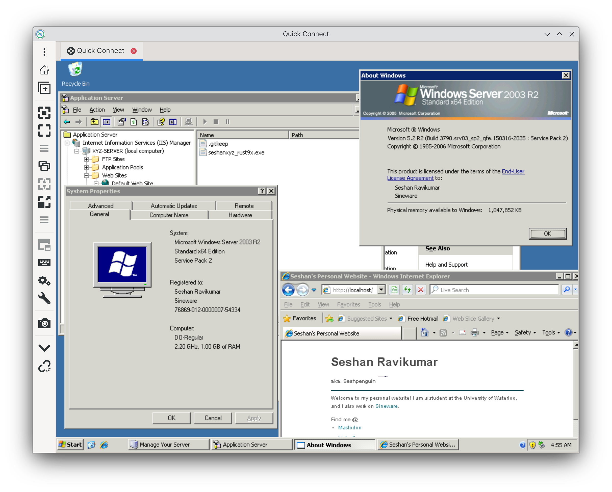
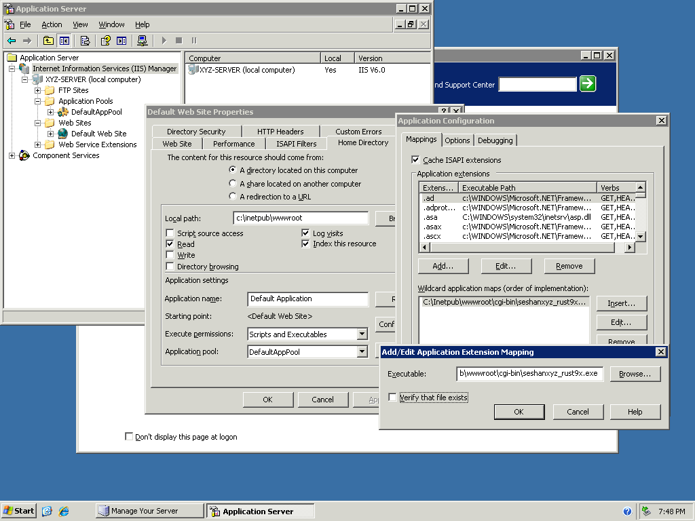

# Seshan.XYZ v4
This is the fourth iteration of my personal website, [seshan.xyz](https://seshan.xyz/).

The first 3 versions were:
- A static site with a ASP VBScript based blog system on Windows Server 2003 R2, IIS 6 (hosted on EC2).
- A WordPress site hosted on a PowerMac G5 running Ubuntu Server 16.04
- A Hugo site running on [Sineware Cloud Services] (a static site host server written in Swift that, as of writing, is not publically available)

For v4, I've decided to return back to Win2k3 with a twist, Rust! This version of my website is written in Rust as a CGI executable that is served by IIS 6. Thanks to [Rust9x](https://github.com/rust9x/rust/wiki), I can compile and run modern Rust programs on versions of windows down to Windows 95! (but let's be honest, Windows Server 2003 R2 was peak).

Essentially this is a CGI Executable that is able to handle routing, static file serving (with HTTP range requests), rendering some templated HTML and markdown, and an RSS feed of the old blog at `/index.xml`.

| Module | What it does |
|---|---|
| `main.rs` | CGI entry point, route table, HTTPS upgrade redirect, `/debug` |
| `site.rs` | Site config, Handlebars templates, markdown rendering |
| `blog.rs` | Blog post listing and front matter parsing |
| `rss.rs` | RSS feed |
| `static_files.rs` | Static files, MIME sniffing, byte ranges |
| `request.rs` / `error.rs` | Header helpers, redirects, and error → HTTP status mapping |

> This should go without saying, but DON'T RUN LEGACY OS' IN PRODUCTION!! I took enough procautions (strict firewall rules, putting it being Cloudflare)
> to feel comfortable enough running this in total isolation from everything, and the stakes are pretty low if something gets cooked (I can just tear everything down).

## Compiling
Unfortunatley, you will need a modern Windows host to compile the CGI executable. Currently the build system is designed to output a x86_64 binary for Windows Server 2003+, however you should be able to modify it to produce a i586 or i686 compatible with Windows 95/NT 3.51+ (you will need the correct Windows SDK libraries and such installed, and change the `/SUBSYSTEM` and `/OSVERSION` link args in .cargo/config.toml).

**Requirements** (aka. how I have everything setup)
- Visual Studio 2022 (with the "C++ Windows XP Tools for VS 2017 (v141)" component installed)
    - This provides the three XP-compatible pieces linked via `/LIBPATH` in .cargo/config.toml: the VC 14.16 runtime, the 10.0.10240 UCRT, and the v7.1A Platform SDK. Check those paths exist on your machine.
    - `BUILD.BAT` runs the build inside a `vcvarsall x64 -vcvars_ver=14.16` environment. Without it, rustc uses the newest MSVC toolset, whose runtime imports Vista+ APIs (e.g. `InitializeCriticalSectionEx`), and the binary won't start on 2003.
- Rust9x 1.85+ (registered as a toolchain with the name "rust9x"). `rust-version` in Cargo.toml keeps dependency upgrades compatible with it.
- npm (to run the build steps automatically)
- python3 (optional, if you want to quickly test CGI using python's http.server)

Run `npm run build` (which calls `BUILD.BAT`) to compile the Rust program and copy it into `cgi-bin`, and `npm test` to run the unit tests. Once that's done, you can try using `npm run serve` to start a Python webserver which can invoke the CGI executable (at http://localhost:8000/cgi-bin/seshanxyz_rust9x.exe/).

To deploy, copy the following directories to the root of your webserver:
- cgi-bin
- content
- public
- templates

The `cgi-bin` and `templates` folders are internal, so you only need to worry about them if you want to customize the HTML (styles, etc). The `content/seshanxyz.toml` file is the configuration for your sites title, header, etc. `content/index.md` is the content for the index page of your website, and `content/blog/` is a directory with all your blog posts (sorted alphabetically).

## Windows Server 2003 in the Cloud
The website is hosted on Digitalocean, which doesn't support Windows droplets (let alone 2003 R2), so how did I do it? In short, I first spun up a large (8GB/4C) temporary droplet. In that droplet I used QEMU (using VNC display mode to access it) to install Windows Server to a raw disk image with the requisite VirtIO drivers (VirtIO Disk during the first stage text-mode install with the VirtIO floppy, then VirtIO networking after the install with the ISO. Note that I used the VirtIO Windows drivers from ~2017 for compatibility reasons). 

After Windows was installed in the QEMU virtual machine, I then created another droplet (this time a small 1GB droplet, which is the final server droplet). Then, I entered the networking details for the final droplet into the Windows QEMU VM (public IP, gateway, etc) and shut it down. I started a Python webserver on the temporary droplet, then booted the final droplet into the Recovery environment. Finally, using the droplet private networking, I used a command like `curl http://private_ip:8000/win.img | dd of=/dev/vda bs=4M status=progress` to flash the Windows image to the final droplet. 

I also made sure to setup a firewall on the final droplet to only allow the [Cloudflare IP ranges](https://www.cloudflare.com/ips/) to access the webserver, and I also use a seperate Linux droplet on the private network to use SSH forwarding to access RDP, FTP, etc in a more secure way. IIS is also configured with a Cloudflare Origin certificate so CF can access it over TLS (though, it's only TLS 1.0).

The CGI executable is registered in the Wildcard application map so all requests get sent to it for handling by IIS (also note that "Verify that files exists" is unchecked, otherwise IIS checks to see if the requested path actually exists on the FS, which is not what you want).